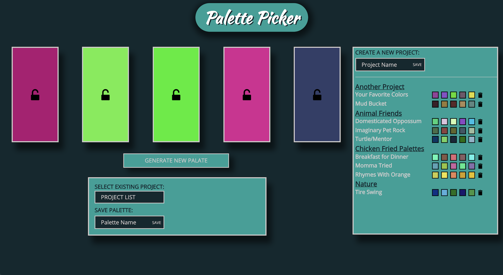

## Palette Picker

An exercise is creating a fully functional application using strictly JQuery and Vanilla JS. A random palette of five colors is generated. A user is able to save the palettes by name and save them in a project. Palettes are stored using a Postgres database.

### Links

- [Palette Picker](https://palette-picker-1804.herokuapp.com/) live on Heroku

### Technologies Used

##### Front-End

- JavaScript
- JQuery

##### Backend-End

- Postgres
- Express
- Knex

### Screenshots



### Next Steps

Additional enhancements will include:

- User is able to delete a project
- Hover over a color to display its hex value

### Set Up

## Initial Setup

1. Clone down this repository
1. Run Command `npm install`

### Setting Up Your Postgres Database

**1. Run `psql` in your terminal**

psql is a terminal-based front-end to PostgreSQL. While you are running it locally you be able to create new databases as well as accessing, editing and deleting existing ones. We access the PostgreSQL by running this command.

**2. Run `CREATE DATABASE [database name]` in your terminal**

We have now initialized our database.

**3. Create a new directory, `cd` into it, and run `npm initial --yes`**

This creates our local directory. We still need Knex with Express to allow us to use Javascript for communicating with the backend.

**4. Run `knex init` in your terminal**

This is the file that you will use to configure your database. You will notice some boilerplate setup, but with some modifications you can better accommodate your project.

Adjust your configuration to look like the following,

```
module.exports = {
  development: {
    client: 'pg',
    connection: 'postgres://localhost/[yourdatabasename]',
    useNullAsDefault: true
  }
};
```

**5. Run `knex migrate:make initial` in your terminal**

This will generate an initial migration. You can edit this newly created file to better suit your schema layout. Use the command `knex migrate:latest` to run all of your migrations. For future adjustments to your schema, rather than continuing to edit the initial migration, you must create a new migration with the following command, `knex migrate:make [adjustment detail]`. **Editing past migration can cause errors!** Further documentation on building out tables can be found [here](https://knexjs.org/).

**5. Run `npm start` to run the application in development**
